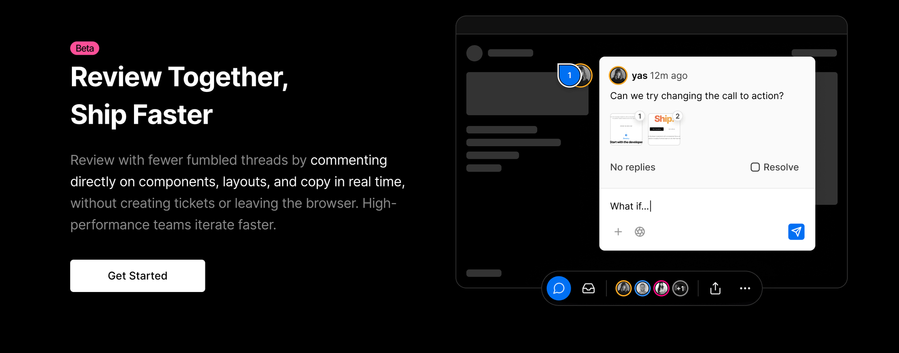

**Time:** max 2h

**Libraries:** any

**Submit:** share a Github repo with fredrika@zealy.io

## Challenge

Create an app where you can add reactions to a web page.

As a user, I should be able to click on a component and react with an emoji and an optional comment. While rescaling the page, the reaction should stay put.

Focus on creating something **good-looking, delightful to use,** and adding fun details or features!

If you don’t have time to finish: make sure it compiles before sending it.

You can draw inspiration from Vercel’s preview function:

Or Figma’s comments:

